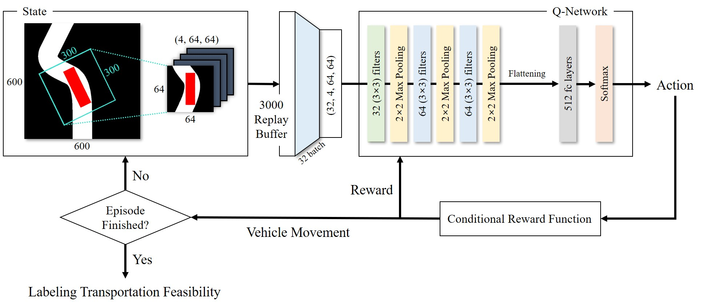
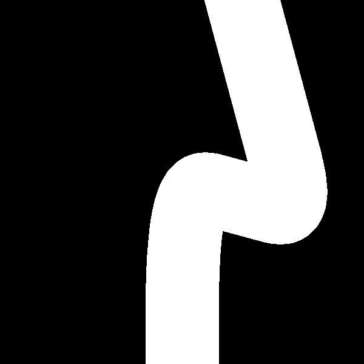
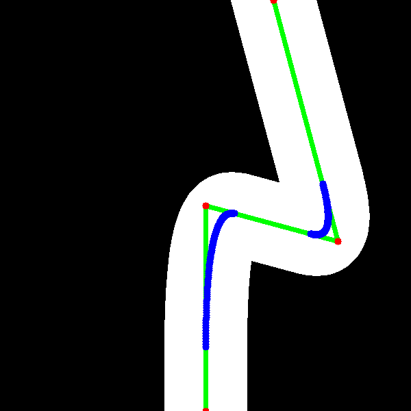

# Cite the paper
This work has been published in IEEE Transactions on Intelligent Transportation Systems. (https://ieeexplore.ieee.org/abstract/document/10359450)

Title: "Feasibility Evaluation of Oversize Load Transportation Using Conditional Rewarded Deep Q-Networks"

```
@article{son2023feasibility,
  title={Feasibility Evaluation of Oversize Load Transportation Using Conditional Rewarded Deep Q-Networks},
  author={Son, Hojoon and Kim, Jongkyu and Jung, Hyunjin and Lee, Minsu and Lee, Soo-Hong},
  journal={IEEE Transactions on Intelligent Transportation Systems},
  year={2023},
  publisher={IEEE}
}
```

</img>


# Auto-Simulation for Swept Path Analysis

### 1. Docker build with shell script file 

```
docker_build.sh
```

### 2. Docker run with shell script file

```
docker_run.sh
```

### 3. Start Automatic Labelling

```
cd train
python automatic_labelling.py
```

# Binary Classification for Transportation Feasibility

```
cd train
```

Train & Test the classifier
```
python cnn_train.py
```


# How to generate road segment data

### 1. Create json file that contains road shape parameters.

```
python draw/generate_roads_v2.py
```

### 2. Load roads from json file.
```
cd train
python load_roads.py
```

You can load original image and marked image.

</img>
</img>


# How to use a manual labelling mode

### 1. Execute python code.

```
cd train
python automatic_labelling.py
```

### 2. Key Funcions

<strong>Q, W</strong>: Rotation(CCW, CW)

<strong>Arrows</strong>: Move up, down, left, right

<strong>T</strong>: Save as True

<strong>F</strong>: Save as False

<strong>R</strong>: Retry

<strong>C</strong>: Capture Current Pygame Image


### Caution: Don't press the down arrow first
